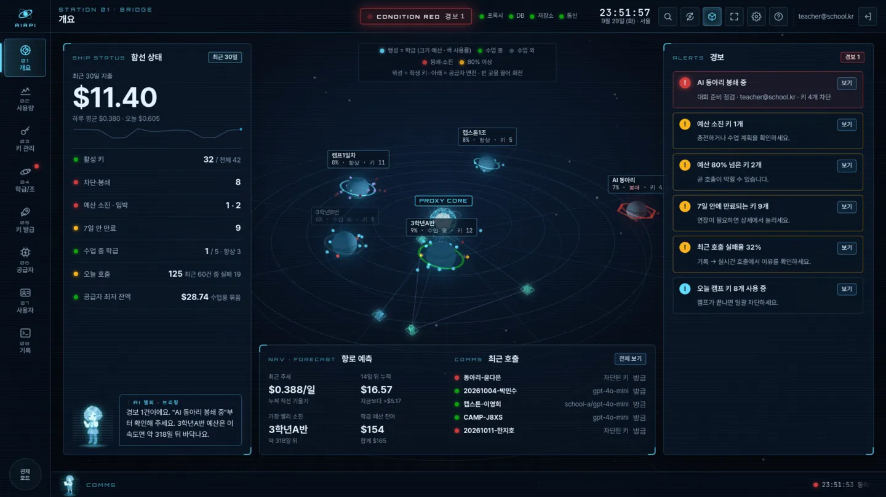
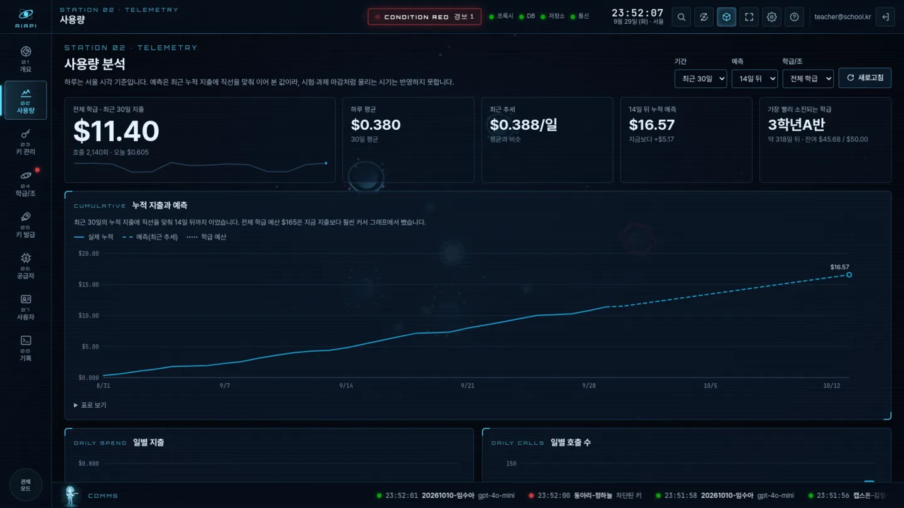
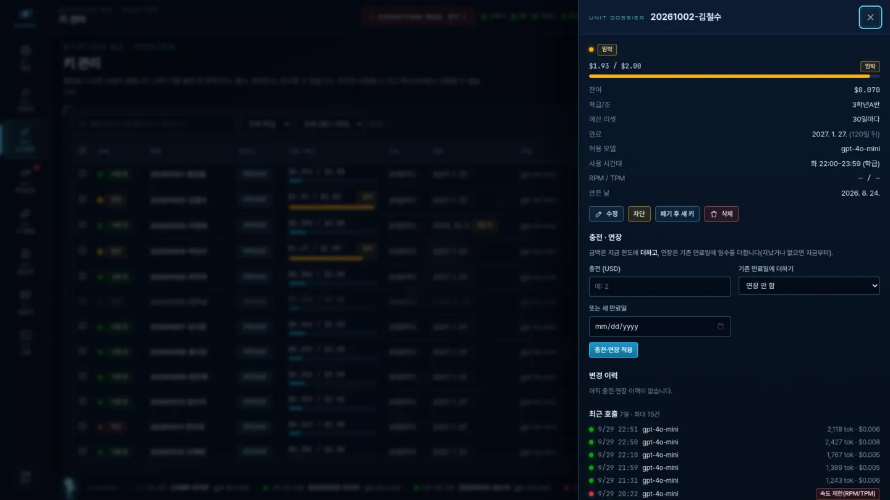
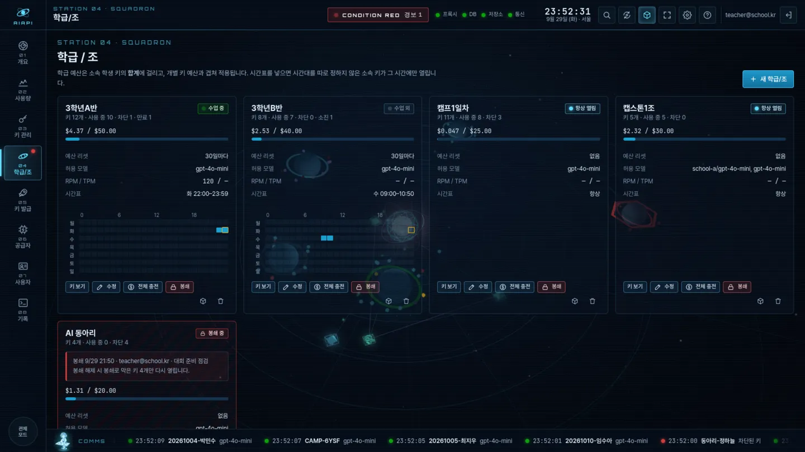
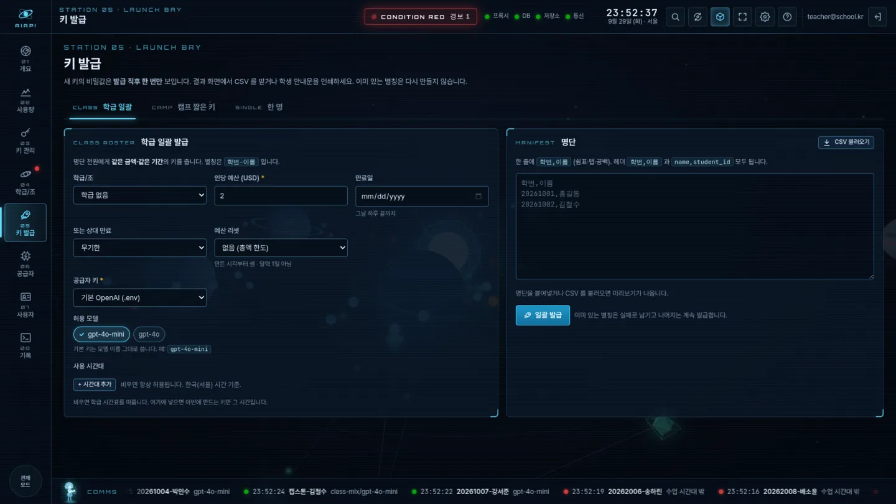
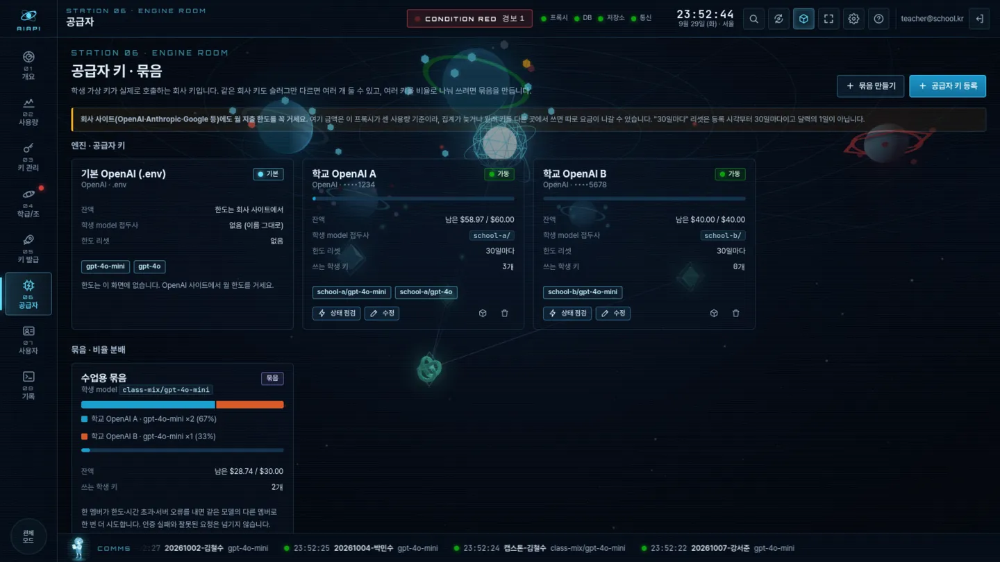
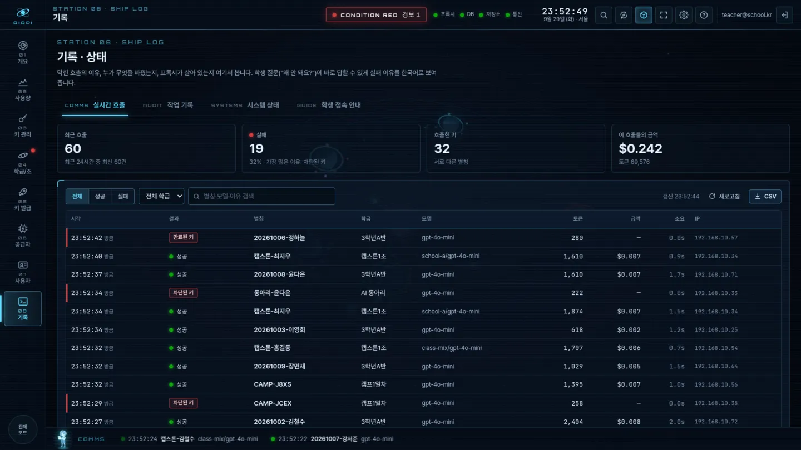
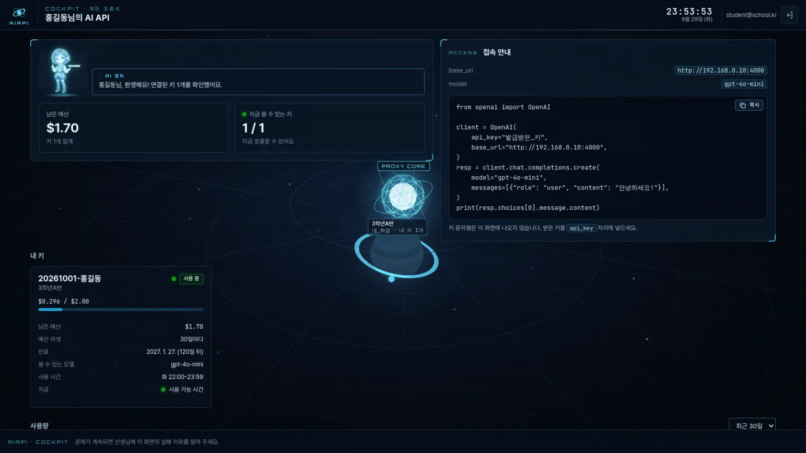
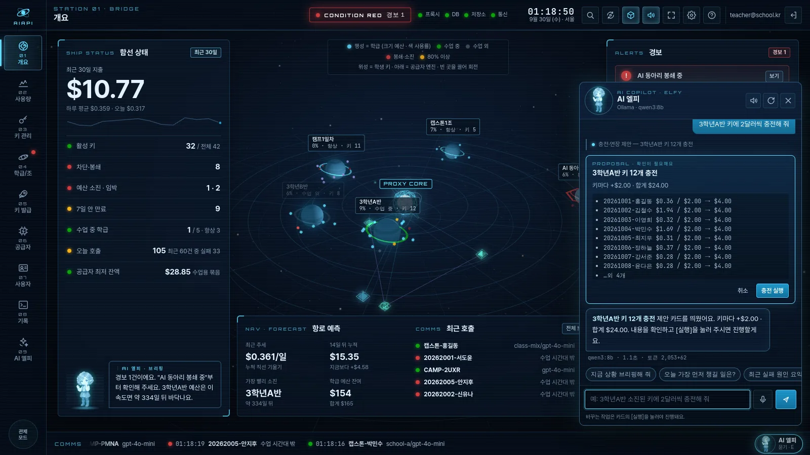
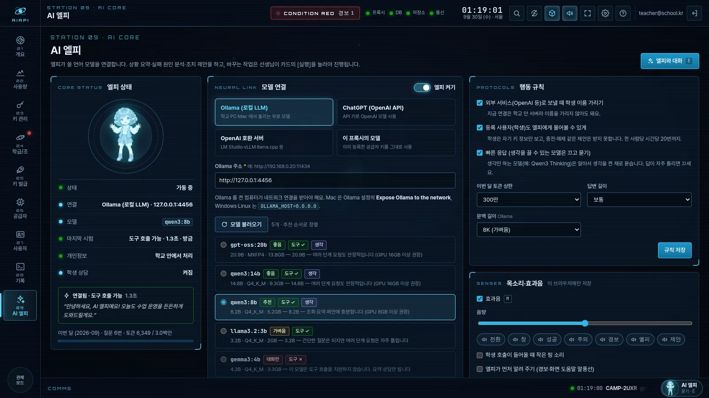

# aiapi-manager

학교 수업용 OpenAI API 사용량 관리 시스템. Synology DS918+ NAS(내부망)에서 LiteLLM Proxy를 돌려
학생별 **가상 API 키**(예산·모델 제한 포함)를 발급하고, Firebase 구글 로그인 기반 관리 화면 **"AIAPI 관제 함교"** 로 관리한다.
관리 화면은 3D 궤도 관제도 위에 8개 스테이션을 둔 우주선 제어판 형태이며, 교실 화면에 띄워 두는 **관제 모드**(자동 순환)를 지원한다.

```
학생 코드 (OpenAI SDK, base_url만 변경)
        │  가상 키 (sk-...)
        ▼
LiteLLM Proxy (:4000) ──── Postgres (키·예산·사용량, 내부 전용)
        │  실제 OpenAI 키 (서버에만 존재)
        ▼
    OpenAI API

관리자 브라우저 ── Google 로그인 (Firebase) ──▶ admin-ui (:3000) ──▶ LiteLLM 관리 API
```

## 구성 요소

| 경로 | 설명 |
|---|---|
| `docker-compose.yml` | LiteLLM + Postgres + admin-ui 세 컨테이너. db·litellm·admin-ui 모두 healthcheck, `depends_on: service_healthy` |
| `litellm/config.yaml` | 학생에게 노출할 모델 목록 |
| `admin-ui/` | 관리 화면 서버(Express)와 화면. Firebase 구글 로그인 → 관리자/등록 사용자 역할 |
| `admin-ui/public/js/` | 관제 함교 화면. `main.js`(진입), `stations/*`(스테이션 8개), `scene/orbital.js`(3D), `pilot.js`(등록 사용자) |
| `admin-ui/public/css/bridge.css` | 테마. 데이터 색은 색각 이상 검증을 통과한 팔레트만 쓴다 |
| `admin-ui/public/charts.js` | 사용량 차트(인라인 SVG, 외부 라이브러리 없음) |
| `admin-ui/lib/` | 서버 로직과 단위 테스트(`npm test`) — 작업 기록, 호출 로그, 학급 봉쇄, 일괄 충전 등 |
| `admin-ui/dev-mock.js` | 개발용. 흉내 LiteLLM + 실제 `server.js` 로 Firebase 없이 화면 전체를 띄운다 (`npm run mock`) |
| `scripts/issue_keys.py` | 학생 명단 CSV로 키 일괄 발급 (표준 라이브러리만 사용) |
| `scripts/revoke_camp_keys.py` | 캠프 키 당일 종료 후 차단·회수 (cron 훅) |

## 공통 사전 준비 (최초 1회)

어디에 설치하든 아래 두 가지를 먼저 끝낸다.

### 1. Firebase 설정 (관리자 로그인용)

설치마다 빠뜨리지 않도록 [Firebase 설정 체크리스트](docs/firebase-checklist.md)를 따른다.

1. [Firebase 콘솔](https://console.firebase.google.com)에서 **프로젝트 추가** (이름 예: `aiapi-manager`, 애널리틱스는 꺼도 됨)
2. 왼쪽 메뉴 **빌드 → Authentication → 시작하기 → 로그인 방법** 탭에서 **Google** 활성화 (지원 이메일 선택 후 저장)
3. **Authentication → 설정 → 승인된 도메인**에 관리자 UI 접속 주소를 추가
   - NAS라면 내부 IP (예: `192.168.0.10`), PC 테스트라면 `localhost`는 기본 포함됨
4. **프로젝트 개요 옆 톱니 → 프로젝트 설정 → 내 앱 → 웹 앱(</>) 추가** → 표시되는 `firebaseConfig`에서
   `apiKey`, `authDomain`, `projectId` 세 값을 `admin-ui/public/firebase-config.js`에 붙여넣기

### 2. 환경 변수 파일 만들기

저장소 루트에서:

```sh
cp .env.example .env
```

`.env`를 열어 다음을 채운다.

| 변수 | 값 |
|---|---|
| `OPENAI_API_KEY` | 기본 OpenAI 키. 관리 화면의 “기본 OpenAI (.env)”가 이 값을 쓴다. 다른 키는 화면에서 추가 |
| `LITELLM_MASTER_KEY` | 관리자용 마스터 키. `echo "sk-$(openssl rand -hex 24)"` 로 생성 |
| `POSTGRES_PASSWORD` | 임의의 강한 비밀번호 |
| `FIREBASE_PROJECT_ID` | Firebase 콘솔의 프로젝트 ID |
| `ADMIN_EMAILS` | 관리자로 허용할 구글 계정 (쉼표 구분) |
| `PUBLIC_PROXY_URL` | (선택) 학생 코드의 `base_url`. 비우면 관리 화면에 접속한 주소 + `LITELLM_PORT` |
| `LITELLM_DISABLE_ADMIN_UI` | (선택) 기본 `True`. LiteLLM 자체 관리 화면(`:4000/ui`)을 끈다. 켜려면 `False` |

> `.env`와 `firebase-config.js` 수정본은 절대 공개 저장소에 올리지 말 것 (`.env`는 `.gitignore` 처리됨).

관리 화면의 **공급자 API 키**에서 같은 회사 키를 여러 개, 다른 회사(Anthropic, Gemini, Groq, OpenRouter, OpenAI 호환 주소)와 Ollama 로컬 모델도 등록할 수 있다. Ollama 주소는 모델이 돌아가는 기기의 `http://호스트:11434` 이다. 프록시 컨테이너 안의 `localhost`는 그 기기가 아니다. 등록할 때 넣는 사용 가능 금액은 그 키의 전체 금액이고, 표의 남은 금액은 전체에서 이 프록시가 센 사용량을 뺀 값이다. 표시 이름, 비밀 키, 금액, 모델은 등록한 키를 지우지 않고 고칠 수 있다. 슬러그와 회사는 학생 `model` 이름에 묶여 있어 바꾸지 않는다. 학생 키를 만들 때 공급자 하나를 고르면, 학생 코드의 `model`은 `슬러그/모델이름`이고 그 키만 탄다. 여러 키를 하나의 모델 이름과 정수 비율로 쓰려면 **원본 API 묶음**을 만든다. 묶음의 최근 호출에서 어느 멤버가 처리했는지 볼 수 있다. 한 멤버가 사용 한도, 응답 시간 초과, 서버 오류를 내면 같은 모델의 다른 멤버를 한 번 더 시도한다. 인증 실패와 잘못된 요청은 다른 멤버로 넘기지 않는다. 학급 시간표는 학급에 저장되고, 시간대를 따로 넣지 않은 소속 키가 그 시간을 따른다. 키에 시간대를 넣으면 그 키만 그 시간을 쓴다. 학생 키의 비밀이 새면 **폐기 후 새 키**로 이전 키를 막고, 별칭은 유지하며 예산은 남은 금액만 준다. 사용 시간대는 한국 시간이다. 화면 한도와 별도로, 키를 발급한 사이트에도 월 한도를 건다. 공급자 키·시간대·묶음을 바꾼 뒤에는 `admin-ui`와 `litellm`을 함께 다시 빌드해야 한다.

## 설치 A: Synology NAS (Container Manager)

DSM 7.2 이상의 **Container Manager** 기준. DS918+ 등 x86 기종에서 동작한다.

1. **Container Manager 설치** — DSM **패키지 센터**에서 `Container Manager` 검색 후 설치
   (구버전 DSM의 `Docker` 패키지도 동일하게 동작)
2. **공유 폴더 준비** — File Station에서 `docker` 공유 폴더(없으면 생성) 아래에 `aiapi-manager` 폴더 생성
3. **프로젝트 파일 올리기** — 두 방법 중 하나:
   - **File Station 업로드**: PC에서 이 저장소를 다운로드(GitHub → Code → Download ZIP)한 뒤 압축을 풀고,
     위 "공통 사전 준비"까지 마친 상태로 전체 폴더를 `docker/aiapi-manager`에 업로드
   - **SSH + git**: 제어판 → 터미널 및 SNMP → SSH 활성화 후
     ```sh
     ssh 관리자계정@NAS주소
     cd /volume1/docker
     git clone https://github.com/progh2/aiapi-manager.git
     cd aiapi-manager
     cp .env.example .env && vi .env        # 값 채우기
     vi admin-ui/public/firebase-config.js  # Firebase 값 입력
     ```
4. **Container Manager에서 프로젝트 생성**
   - Container Manager 실행 → 왼쪽 **프로젝트** → **생성**
   - 프로젝트 이름: `aiapi-manager`
   - 경로: `docker/aiapi-manager` 선택 → 기존 `docker-compose.yml`을 감지하면 **기존 파일 사용** 선택
   - 웹 포털 설정은 건너뛰어도 됨 → 완료를 누르면 이미지 다운로드·빌드 후 컨테이너 3개가 기동됨
     (admin-ui는 Dockerfile 빌드라 최초 기동에 몇 분 걸릴 수 있음)
5. **동작 확인**
   - 관리자 UI: `http://NAS내부IP:3000` → Google 로그인 → 키 발급 테스트
   - 프록시: `http://NAS내부IP:4000/health/liveliness` 가 응답하면 정상
   - 관리자 UI 헬스: `http://NAS내부IP:3000/health` → `{"status":"ok"}`
6. **포트가 겹칠 때** — NMS/PartDB 등 기존 서비스가 3000/4000을 쓰고 있다면 `.env` 의
   `LITELLM_PORT`·`ADMIN_UI_PORT`(DB 는 `POSTGRES_HOST_PORT`, NAS 안에서만 열림)를 바꾼다.
7. **DSM 방화벽** — 방화벽을 켜 두었다면 제어판 → 보안 → 방화벽 규칙에 `LITELLM_PORT`(기본 4000)와 `ADMIN_UI_PORT`(3000) 허용을 더한다.
   litellm 은 학생 PC 의 실제 IP 를 기록하려고 NAS 네트워크에 직접 붙어 있어 방화벽 규칙을 따른다([학생 PC 의 실제 IP 기록](#학생-pc-의-실제-ip-기록)).
8. **업데이트** — 저장소를 갱신(재업로드 또는 `git pull`)한 뒤 프로젝트 선택 → **동작 → 빌드**로 재빌드,
   또는 SSH에서 `docker compose up -d --build`. 이걸 NAS 가 알아서 하게 하려면 [자동 업데이트](#자동-업데이트-nas)

## 자동 업데이트 (NAS)

GitHub `main` 에 새 버전이 올라오면 NAS 가 **10분마다 스스로 확인해 가져오고 다시 빌드**한다.
NAS 는 학교 내부망이라 GitHub 가 알려 줄 수 없어(웹훅), NAS 가 먼저 묻는 방식이다.

- 새 버전이 제대로 뜨지 않으면(컨테이너 건강 확인 실패) **이전 버전으로 되돌린다**
- NAS 에서 저장소 파일을 고쳐 두었거나 기록이 갈라졌으면 건드리지 않고 멈춘다(포트 등은 `.env` 로)
- 결과는 관리 화면 **08 기록 → 시스템 상태 → 자동 업데이트** 줄에 보이고, 실패하면 개요 경보에도 뜬다.
  자세한 기록은 `admin-ui/data/auto-update.log`
- 보통은 관리 화면만 몇 초 다시 뜨고, 학생 API(LiteLLM)는 설정이 바뀔 때만 다시 시작한다.
  수업 중 적용을 피하려면 적용 시각을 정한다(`AIAPI_UPDATE_HOURS="0-7,17-23"`, 확인은 계속하고 적용만 미룸)

**준비 (한 번만, 5분)**

1. DSM **패키지 센터 → Git Server** 설치(git 명령이 생긴다). 제어판 → 터미널 및 SNMP 에서 SSH 켜기
2. SSH 로 NAS 에 들어가 준비 스크립트를 실행한다
   ```sh
   sudo bash /volume1/docker/aiapi-manager/scripts/nas-auto-update-setup.sh
   ```
   읽기 전용 **배포 키**를 만들어 보여 준다 → GitHub 저장소 **Settings → Deploy keys → Add deploy key** 에 붙여 넣는다(쓰기 권한은 끈다).
   연결을 시험하고(학교 방화벽이 22번을 막으면 443번으로), ZIP 으로 설치한 폴더면 `.env`·데이터는 그대로 둔 채 git 저장소로 바꾼 뒤 첫 확인을 한다
3. DSM **제어판 → 작업 스케줄러 → 생성 → 예약된 작업 → 사용자 정의 스크립트**
   - 사용자 `root`, 일정 매일 · 10분마다(00:00 ~ 23:50)
   - 스크립트 `bash /volume1/docker/aiapi-manager/scripts/nas-auto-update.sh`
   - "비정상 종료 시에만 실행 세부 정보를 이메일로 보내기"를 켜면 실패를 메일로 받는다

스크립트 시험: `bash scripts/nas-auto-update.test.sh` (가짜 GitHub·가짜 docker 로 적용·되돌림·대기·잠금을 확인한다).

## 설치 B: 일반 PC / 서버

Docker Desktop(Windows/Mac) 또는 docker engine + compose plugin(Linux)이 설치되어 있으면 된다.

```sh
git clone https://github.com/progh2/aiapi-manager.git
cd aiapi-manager
cp .env.example .env                      # 값 채우기 (공통 사전 준비 참고)
# admin-ui/public/firebase-config.js 에 Firebase 값 입력
docker compose up -d --build
```

- 관리자 UI: `http://localhost:3000`, 프록시: `http://localhost:4000`
- **Docker Desktop(Windows·Mac)** 은 호스트 네트워크가 기본으로 꺼져 있다. 브리지 덧붙이기 파일로 띄운다
  (호출 IP 는 도커 주소로 기록된다): `docker compose -f docker-compose.yml -f docker-compose.bridge.yml up -d --build`
- 학생들이 접속해야 한다면 PC의 내부 IP(예: `http://192.168.0.20:4000`)를 안내하고,
  그 주소를 Firebase 승인된 도메인에도 추가한다. PC가 꺼지면 서비스도 꺼지므로 상시 운영은 NAS 쪽을 권장.
- 중지: `docker compose down` / 로그 확인: `docker compose logs -f litellm`

## 관리 화면 둘러보기 (관제 함교)



<details><summary>다른 스테이션 화면 보기</summary>

| | |
|---|---|
|  |  |
|  |  |
|  |  |
|  | |

화면은 `npm run mock` 의 시연 데이터다.
</details>

로그인하면 부팅 화면 뒤에 3D 궤도 관제도와 스테이션 레일이 뜬다. 레일 버튼이나 숫자 키 `1`~`9` 로 옮겨 다닌다.
주소 끝의 `#keys` 같은 해시로 새로고침해도 그 자리를 지킨다.

| 번호 | 스테이션 | 하는 일 |
|---|---|---|
| 01 | **개요** | 3D 관제도, 함선 상태(지출·활성 키·차단·만료 임박·수업 중 학급·공급자 잔액), 경보, 예측, 최근 호출, AI 엘피 브리핑 |
| 02 | **사용량** | 누적+예측, 일별 지출, 일별 호출 수, 학생별·학급별·**모델별** 지출. 차트마다 "표로 보기" |
| 03 | **키 관리** | 검색·필터, 여러 키 **일괄 차단·해제·충전·회수·새 키로 교체**, CSV 내보내기, 별칭을 누르면 **상세 서랍**(가려진 키 보기·복사, 충전·연장·이력·그 키의 최근 호출) |
| 04 | **학급/조** | 학급 카드(예산 게이지, 수업 중 여부, 주간 시간표 격자), 수정, **학급 전체 충전**, **봉쇄/해제** |
| 05 | **키 발급** | 학급 일괄(명단 미리보기 표), 캠프 짧은 키, 한 명. 결과에서 CSV·**학생 안내문 인쇄** |
| 06 | **공급자** | 공급자 키·묶음 카드, **상태 점검**(저장된 키로 모델 조회·지연 시간), 등록·수정, 묶음 최근 호출 |
| 07 | **사용자** | 등록 사용자 추가·**수정**·삭제, 연결 키 검색 선택기 |
| 08 | **기록** | **실시간 호출**(실패 이유 한국어), **작업 기록**(누가·언제·무엇을), **시스템 상태**, **학생 접속 안내**(예제 코드·인쇄) |
| 09 | **AI 엘피** | 엘피가 쓸 언어 모델 연결(Ollama·ChatGPT API·호환 서버·이 프록시), 모델 불러오기·연결 시험, 행동 규칙, 목소리·효과음 |

### 3D 관제도 읽는 법

- 가운데 **코어** = 프록시(LiteLLM). 아래쪽 팔면체 = 공급자 키, 매듭 모양 = 묶음
- **행성** = 학급. 크기는 키 수, 색은 예산 사용률(청록 → 80% 주황 → 소진 빨강)
- 행성 **고리**: 수업 중(녹색, 깜빡임) · 항상 열림(청록) · 수업 외(회색) · **봉쇄**(빨간 육각)
- **위성** = 학생 키. 상태색(사용 중 청록·임박 주황·소진 빨강·차단 어두운 빨강·만료 회색·캠프 보라)
- 실제 호출이 들어오면 위성 → 코어 → 엔진으로 빛이 흐르고, **막힌 호출은 코어에서 붉게 튕긴다**
- 빈 곳을 끌면 회전, 행성·위성·엔진을 누르면 해당 상세로 간다. 모든 정보는 패널에도 있어 3D 는 보조 표시다
- WebGL 이 없거나 느린 PC 는 자동으로 저사양 모드가 되고, 상단 큐브 버튼(`T`)이나 설정에서 끌 수 있다

### 관제 모드 (교실 화면용)

상단의 순환 버튼이나 `A` 로 켠다. 읽기 전용 스테이션(개요·사용량·학급·공급자·기록)을 정한 간격(기본 20초)으로 돌며 보여 준다.
마우스를 누르거나 키를 치면 30초 멈춘다. 간격과 돌 스테이션은 **설정**에서 고른다. 전체 화면은 `F`.

### 단축키

| 키 | 동작 |
|---|---|
| `1`~`9` | 스테이션 이동 (`9` = AI 엘피 설정) |
| `E` | AI 엘피에게 묻기 (대화창 열고 닫기) |
| `M` | 효과음 켜고 끄기 |
| `Ctrl`+`K` | 명령 팔레트 — 키 별칭·학급·작업 검색 |
| `/` | 키 검색 |
| `A` / `T` / `F` / `R` | 관제 모드 / 3D 켜고 끄기 / 전체 화면 / 새로고침 |
| `Esc` | 창 닫기, 입력칸에서 빠져나오기 |

한글 자판 상태에서도 된다(글자가 아니라 키 위치로 판단).

### 설정

움직임 줄이기(회전 전환·깜빡임·타자 효과 끔, 운영체제 설정도 따름), 대비 강화(밝은 교실·프로젝터), 3D 품질·이름표,
관제 모드 간격·순환 스테이션, 학생 안내 주소(주소가 자동으로 맞지 않을 때), 효과음·음량·호출 핑·엘피 말풍선을 바꿀 수 있다.
설정은 브라우저마다 저장된다.

### 등록 사용자(학생·교사) 화면

`ADMIN_EMAILS` 가 아닌 등록 사용자는 **조종석** 화면을 본다. 연결된 키(가려져 있고 마우스를 올리면 보임), 남은 예산, 지금 쓸 수 있는 시간인지,
사용량 차트, **최근 호출과 막힌 이유**(예: 수업 시간대 밖, 예산 초과, 허용 안 된 모델), 접속 주소와 예제 코드가 나온다.
키 해시·IP 는 보이지 않는다. 키 원문은 학생이 마우스를 올리거나 복사할 때만 받아 온다.

## 새로 들어간 운영 기능

- **학급 봉쇄/해제** — 시험·사고 때 학급의 열린 키를 한 번에 막는다. 해제는 **봉쇄로 막은 키만** 다시 열고,
  봉쇄 전부터 막혀 있던 키와 폐기된 키(`-폐기`)는 그대로 둔다. 표시는 키·학급 `metadata.aiapi_lockdown`. API `POST /api/teams/lockdown {team_id, action: "lock"|"unlock", reason?}`
- **일괄 해제·충전** — `POST /api/keys/revoke` 에 `action=unblock` (폐기된 키는 거절). `POST /api/keys/adjust/bulk {tokens | team_id, add_budget?, add_days?, expires?}` — 이력은 키마다 남는다
- **작업 기록** — 관리 작업을 `admin-ui/data/audit.jsonl` 에 최근 5000건 남긴다(비밀 키 값은 남기지 않음). `GET /api/audit`
- **실시간 호출** — `GET /api/activity` 가 LiteLLM `/spend/logs/v2` 에서 시각·별칭·학급·모델·토큰·금액·성공 여부와 **실패 이유(한국어)** 만 준다.
  프롬프트와 응답은 옮기지 않는다. 등록 사용자는 `GET /api/my/activity` 로 자기 키 것만 본다
- **시스템 상태** — `GET /api/status` (LiteLLM 생존·DB 연결·저장소·버전)
- **학생 안내문** — 일괄·캠프 발급 결과에서 키·접속 주소·예제 코드가 담긴 절취용 카드를 인쇄한다
- 묶음의 **최근 호출**이 실제 호출을 보여 준다(이전에는 일별 요약 응답을 읽어 늘 비어 있었다)

## AI 엘피 (Ollama · ChatGPT 연결)



<details><summary>09 AI 엘피 설정 화면 보기</summary>


</details>

하단 오른쪽의 **엘피**를 누르거나 `E` 를 누르면 대화창이 열린다. 말로 부탁하면 엘피가 알아듣고 움직인다.

- **상황 요약·상담** — "지금 상황 브리핑해 줘", "요즘 왜 이렇게 실패가 많아?", "이번 달 사용량 예측해 줘"
- **원인 분석** — 실제 호출 기록과 실패 이유를 조회해 학급·학생별로 풀어 준다
- **작업 제안** — "3학년A반 소진된 키에 2달러씩 충전해 줘", "3학년B반 내일 시험이라 막아 줘", "홍길동 키 일주일 연장해 줘".
  엘피는 **제안 카드**만 만든다. 대상 키 목록과 전후 값을 보여 주고, 선생님이 **[실행]** 을 눌러야 기존 관리 API 로 진행된다.
  봉쇄·대량 차단·큰 금액 충전은 확인 낱말을 입력해야 켜진다. 실행한 작업은 작업 기록에 **엘피 제안** 표시가 붙는다
- **화면 이동** — "소진된 키 보여줘"라고 하면 키 관리 화면을 그 조건으로 연다
- **먼저 알려 주기** — 새 경보가 뜨면 말풍선으로 알리고 [엘피에게 맡기기]로 이어서 물을 수 있다. 스테이션에 처음 들어오면 도움말을 건넨다
- **학생 상담(선택)** — 켜 두면 등록 사용자도 자기 키의 예산·사용 시간·실패 이유·코드 사용법을 물을 수 있다(제안 카드는 없음)
- 엘피가 할 수 없는 일: 키 삭제·새 키 발급·공급자 키 등록·사용자 등록(알맞은 화면을 열어 준다)

### 연결하기

**09 AI 엘피** 화면에서 연결 방식을 고른다.

| 방식 | 넣을 것 | 참고 |
|---|---|---|
| **Ollama (로컬 LLM)** | 주소 `http://PC주소:11434` | 무료. 학교 PC나 Mac 에서 돌린다. 학생 데이터가 학교 밖으로 나가지 않는다 |
| **ChatGPT (OpenAI API)** | API 키 `sk-...` | 키는 `admin-ui/data/assistant.json` 에만 저장되고 화면으로 다시 나오지 않는다 |
| **OpenAI 호환 서버** | 주소(`.../v1`)·키(선택) | LM Studio·vLLM·llama.cpp 서버 등 |
| **이 프록시의 모델** | 모델·월 예산 | 이미 LiteLLM 에 등록한 공급자 키를 그대로 쓴다. `aiapi-assistant` 가상 키를 만들어 예산을 걸고, 사용액이 사용량 화면에 잡힌다 |

**모델 불러오기** → 목록에서 고르기(도구 호출 지원·크기·추천 표시) → **연결 시험**(도구 호출이 되는지와 첫 인사를 확인) → **저장**.
처음 부르는 모델은 불러오느라 수십 초 걸릴 수 있다.

### Ollama 준비 (학교 PC·Mac)

시놀로지 NAS(DS918+)는 LLM 을 돌릴 수 없다. GPU 가 있는 PC 나 Apple M 칩 Mac 에 [Ollama](https://ollama.com/download) 를 깔고, 관리 화면이 네트워크로 부를 수 있게 연다.

```sh
ollama pull qwen3:8b        # 또는 gemma4, qwen3:30b 등
```

- **Mac**: 메뉴 막대 Ollama → Settings → **Expose Ollama to the network** 켜기
  (설정이 없으면 `launchctl setenv OLLAMA_HOST "0.0.0.0:11434"` 후 Ollama 를 다시 실행). "들어오는 연결 허용" 창이 뜨면 허용
- **Windows**: 시스템 환경 변수 `OLLAMA_HOST=0.0.0.0` 추가 → Ollama 다시 실행 → Windows 방화벽에서 11434 포트 허용
- **Linux**: `sudo systemctl edit ollama` 에 `[Service]` `Environment="OLLAMA_HOST=0.0.0.0:11434"` → `sudo systemctl restart ollama`
- **잠자기 끄기**: Ollama PC 가 잠들면 엘피가 "연결하지 못했습니다(시간 초과)"를 낸다. 수업 시간에는 절전을 끄거나 Mac 은 터미널에서 `caffeinate -s` 를 켜 둔다
- 다른 PC 에서 `curl http://PC주소:11434/api/version` 이 버전을 돌려주면 준비 끝

### 어떤 모델이 필요할까

엘피가 **조회·제안**을 하려면 모델이 **도구 호출(tool calling)** 을 지원해야 한다. 모델 목록의 `도구 ✓` 표시를 본다.

| 엘피가 할 일 | ChatGPT (OpenAI) | Ollama (로컬) | 필요한 컴퓨터 |
|---|---|---|---|
| 상황 요약·상담만 | gpt-4o-mini · gpt-5-nano | gemma4:e2b · qwen3:4b · llama3.2:3b | GPU 없어도 됨(느림), 메모리 16GB |
| **권장** · 조회·원인 분석·충전/차단 제안 | **gpt-4.1-mini · gpt-5-mini** | **qwen3:8b · gemma4 (8B)** | GPU 8GB 이상, 또는 Apple M 칩 16GB 이상 |
| 여러 단계 요청도 안정적으로 | gpt-4.1 · gpt-5 | qwen3:30b · qwen3.5:27b · gpt-oss:20b | GPU 16~24GB, 또는 Apple M 칩 32GB 이상 |

실제로 Mac(Apple M 칩)의 Ollama 0.34 에 이 저장소의 엘피를 붙여 시험한 결과(2026-09-30):

| 모델 | 크기 | 도구 호출 시험 | 시나리오(요약·실패 원인·학급 충전·봉쇄 해제·화면 열기) | 한 번 답하는 시간 |
|---|---|---|---|---|
| gemma4 (8B) | 9.6GB | 통과 | 충전·봉쇄·연장 제안, 화면 이동, 실패 원인 조회 모두 성공. 요약에서 숫자를 잘못 읽은 적이 있다 | 2~6초 |
| qwen3:30b (MoE, Thinking) | 18.6GB | 통과 | 도구 선택이 정확하고 답이 간결하다 | 11~31초 (생각 단계) |
| qwen3.5:27b | 17.4GB | 통과 | 요약이 가장 자연스럽고 정확했다(일부 시나리오만 시험) | 첫 답 47초(불러오기 포함) |
| gemma4:e2b (5B) · llama3.1 (8B) | 7.2GB · 4.9GB | 통과 | 도구 호출 시험만 | — |

작은 모델일수록 되묻거나 숫자를 잘못 읽는 일이 잦다. 엘피는 제안 카드에 서버가 계산한 **실제 대상과 전후 값**을 보여 주므로, 실행 전에 카드 내용을 확인하면 된다.

- 질문 한 번에 보통 입력 3천~1만 토큰, 출력 수백 토큰을 쓴다. OpenAI mini 급이면 한 번에 1센트가 채 안 든다. 이번 달 질문 수·토큰은 09 화면 상태판에 나오고, **월 토큰 상한**으로 막을 수 있다
- 생각(추론)하는 모델은 정확하지만 느리다. **빠른 응답**을 켜면 생각을 끌 수 있는 모델은 끄고 묻고, 생각만 하는 모델(예: Qwen3 Thinking)은 알아서 켠 채로 묻는다

### 개인정보와 안전

- 엘피에게 가는 것: 선생님 질문, 현재 상황표(경보·키 개수·학급 예산·실패 이유 집계), 엘피가 부른 조회 결과. **API 키·키 해시·학생 프롬프트·IP 는 보내지 않는다**
- **학생 이름 가리기**(기본 켬): OpenAI 처럼 학교 밖 서비스로 보낼 때 별칭의 이름을 `학생07` 같은 가명으로 바꾸고, 돌아온 답과 도구 인자는 원래 이름으로 되돌린다. Ollama·사설망 서버는 가리지 않는다
- 엘피는 조회·제안만 한다. 모든 변경은 제안 카드의 [실행] → 기존 관리 API(권한·검증·작업 기록 그대로)로만 일어난다
- 사용량 제한: 관리자 시간당 120번, 학생 시간당 20번, 동시에 3개, 월 토큰 상한. 대화 내용은 서버에 남기지 않는다(컨테이너 로그에는 단계 수·시간·토큰만)
- 설정 파일 `admin-ui/data/assistant.json`(권한 600)에 API 키가 들어 있다. `data/` 는 git 에 올라가지 않는다

### 효과음과 전환 효과

- 효과음은 소리 파일 없이 브라우저가 그때그때 합성한다(교실 망에서 받을 파일이 없다). 스테이션 전환 바람 소리, 창 열기·닫기, 성공·주의·오류, **CONDITION RED 사이렌**, 엘피 말하기·생각·제안 카드 소리
- 관제 모드 자동 순환 때는 조용하다. 학생 호출이 들어올 때 작은 핑 소리는 설정에서 따로 켠다
- 상단 스피커 버튼이나 `M` 으로 끄고, 음량은 설정이나 09 화면에서 바꾼다. 브라우저는 처음 한 번 누르기 전에는 소리를 막는다
- 스테이션을 바꾸면 3D 회전 전환에 더해 패널이 차례로 켜지고, 스캔 빛줄기가 지나가고, 화면 이름이 잠깐 흔들린다. 창은 홀로그램처럼 가로줄에서 펼쳐진다. **움직임 줄이기**를 켜면 모두 멈춘다
- 엘피 목소리(한국어 TTS)는 09 화면에서 켠다. 말로 묻기(마이크)는 https 나 localhost 에서만 된다

## 학생이 로그인해 자기 키 보기

키를 하나하나 나눠 줄 필요 없이 **"관리 화면 주소에 네 학교 구글 계정으로 로그인해서 보면 돼"** 로 끝낸다.

1. **05 키 발급 → 학급 일괄** 명단에 이메일 칸을 넣는다 (`학번,이름,이메일`). 발급하면서 학생 계정이 등록되고 키가 연결된다
2. 학생에게 관리 화면 주소(`http://NAS:3000`)만 알려 준다. 학생은 등록한 구글 계정으로 로그인하면 **조종석 → 내 키** 카드에서 키를 본다
   - 키는 가려져 있다(`sk-••••7Q2x`). **마우스를 올리는 동안**(터치는 👁 을 누르면 10초) 보이고, **복사 버튼**으로만 복사된다
   - **[내 키 넣어 코드 복사]** 를 누르면 키가 들어간 파이썬 예제가 복사된다
   - 학생이 키를 처음 보거나 복사하면 **08 기록 → 작업 기록**에 "키 확인"으로 남는다
3. 이 기능 전에 만든 키는 원문이 없어 학생 화면에 보이지 않는다. **03 키 관리 → 상태 "학생 화면에 안 보이는 키"** 로 골라 **새 키로 교체**하면 된다(옛 키는 막히니 학생에게 새 키로 바꿔 넣으라고 알린다)
4. 이미 만든 키에 계정만 붙이려면 같은 명단(이메일 칸 포함)으로 다시 일괄 발급한다. 이미 있는 별칭은 새로 만들지 않고 계정만 연결한다. 한 명씩은 **07 사용자**에서 연결한다

**보관 방식** — LiteLLM 은 키 원문을 저장하지 않으므로, 관리 서버가 발급 응답의 원문을 `admin-ui/data/key-vault.json` 에 AES-256-GCM 으로 암호화해 둔다.
비밀 값은 `.env` 의 `KEY_VAULT_SECRET`(비우면 `LITELLM_MASTER_KEY`). 비밀 값을 바꾸면 보관한 키는 풀리지 않으니 새 키로 교체한다.
`data/` 를 백업할 때 이 파일도 함께 챙긴다. 관리자도 키 상세에서 보관된 키를 보고 복사할 수 있고, 역시 기록에 남는다.
`scripts/issue_keys.py`(CLI)로 만든 키는 관리 서버를 거치지 않아 보관되지 않는다.

## 학생 PC 의 실제 IP 기록

기록 → 실시간 호출의 **IP** 칸은 LiteLLM 이 받은 연결의 보낸 주소다.

- litellm 컨테이너는 **NAS 네트워크에 직접 붙는다**(`network_mode: host`). 도커 브리지에서 포트를 공개하면
  시놀로지 도커가 연결을 대신 넘겨 모든 호출이 도커 게이트웨이(`172.x.0.1`)로 찍히기 때문이다.
  학생 주소는 그대로 `http://NAS:4000` 이다.
- DB 는 NAS 자신(`127.0.0.1:15432`)에만 열리고, 관리 화면은 `host.docker.internal` 로 litellm 을 부른다.
- 예전 기록이나 브리지로 띄운 곳의 `172.x.0.1` 은 화면에 **도커 내부**로 표시된다(학생 PC 의 IP 가 아님).
- DSM 역방향 프록시 같은 것을 LiteLLM 앞에 두면 IP 가 그 프록시(`127.0.0.1`)로 찍힌다. 그때는 프록시가
  `X-Forwarded-For` 를 실제 주소로 넘기게 하고 `litellm/config.yaml` 의 `general_settings` 에 `use_x_forwarded_for: true` 를 더한다
  (프록시 없이 켜면 학생이 헤더로 IP 를 속일 수 있다).
- 키가 학생마다 따로라 "누가 불렀는지"는 IP 없이도 정확하다. IP 는 키를 나눠 쓰는지, 시험 중 어느 자리 PC 에서 불렀는지 볼 때 쓴다.

## 4000번 포트(LiteLLM) 페이지는 무엇인가

- `http://NAS:4000/` 을 브라우저로 열면 LiteLLM 이 자동으로 만든 **API 문서(Swagger)** 가 나온다.
  학생 코드가 접속하는 **엔진이라 절대 끄면 안 되지만, 화면에서 할 일은 없다.**
- `http://NAS:4000/ui` 는 LiteLLM 자체 관리 화면이다. 이 관리 화면(3000번)이 대신하므로 **기본으로 끈다**
  (`LITELLM_DISABLE_ADMIN_UI=True` → "Admin UI Disabled" 안내가 뜬다). 꼭 필요하면 `.env` 에 `False` 로 두고 `docker compose up -d litellm`.
- Swagger 문서까지 숨기려면 `docker-compose.yml` 의 litellm `environment` 에 `NO_DOCS: "True"` 를 더한다(그러면 루트 주소는 404).

## 개발: Firebase 없이 화면 띄우기

```sh
cd admin-ui
npm install
npm run mock      # http://127.0.0.1:3456  (관리자) · /?as=student@school.kr (등록 사용자)
```

`dev-mock.js` 는 흉내 LiteLLM(학급 5개·키 40여 개·공급자 2개·묶음 1개와 30일 사용 기록)을 띄우고,
가짜 학생 호출을 계속 만들면서 **실제 `server.js`** 를 그대로 올린다. 인증만 스텁이다. `MOCK_SIMULATE=0` 이면 가짜 호출을 멈춘다.
`dev-llm.js` 는 AI 엘피용 **흉내 LLM**(:4456, Ollama·OpenAI 호환)이다. 낱말 규칙으로 도구를 불러 제안 카드까지 시연한다.
엘피는 처음부터 이 흉내 Ollama 에 연결되어 있고, `MOCK_ASSISTANT=off` 면 설정을 비운 채 시작한다. 배포에는 쓰지 않는다.
주소에 `?login=1` 을 붙이면 실제 구글 로그인처럼 로그인 화면부터 시작해, 로그인 뒤 흐름을 시험할 수 있다(`?login=1&as=student@school.kr` 는 등록 사용자).

## NAS/PC 재확인 (이슈 #9)

P0 [#2](https://github.com/progh2/aiapi-manager/issues/2)·[#3](https://github.com/progh2/aiapi-manager/issues/3)을 tarho.local / Synology / PC에서 다시 확인하는 런북: [docs/nas-pc-recheck.md](docs/nas-pc-recheck.md). 결과는 [이슈 #9](https://github.com/progh2/aiapi-manager/issues/9)에 붙인다.

## 사용량 대시보드와 예측

관리자 UI 상단에서 기간(14~90일)과 예측 구간(7~30일)을 골라 볼 수 있다.

- **요약 카드** — 기간 총 지출, 하루 평균, 최근 추세($/일), N일 뒤 누적 예측, 학급/조 예산 소진 예상일
- **누적 지출과 예측** — 실선은 실제, 점선은 예측. 학급/조 예산 합계가 지출과 비슷한 규모면 예산선도 함께 그린다
- **일별 지출** — 하루 단위 막대. 주말·과제 마감 같은 패턴이 드러난다
- **학생별 / 학급/조별 지출** — 회색 트랙이 예산, 색 막대가 사용액. 예산을 넘긴 학생은 빨간 막대에 `초과` 표시

### 예측 방식과 한계

최근 기간의 **누적 지출에 최소제곱 직선을 맞춰** 연장한 값이다(단순 선형 추세). 계산은 서버의
`forecast()` 한 함수에 있고, 그래서 다음 성질을 갖는다.

- 지금까지의 속도가 유지된다고 가정한다. **시험 기간이나 과제 마감처럼 사용이 몰리는 구간은 반영하지 못한다.**
- 방학·휴일로 사용이 끊기면 예측이 과대평가된다. 반대로 학기 초 데이터로 예측하면 과소평가되기 쉽다.
- 기록이 3일 미만이면 예측을 내지 않는다.

즉 **"이 속도라면 대략 이쯤"** 정도의 감을 잡는 용도이고, 정확한 지출 보장이 아니다.
실제 차단은 예측이 아니라 LiteLLM의 예산 한도가 담당한다.

데이터 출처는 LiteLLM의 `/user/daily/activity`다. (`/global/spend/report`는 엔터프라이즈 전용이라 쓰지 않는다.)

## 학급/조 운영

반이나 조 단위로 묶어 관리할 수 있다. **학급/조 예산은 소속 학생들의 합산 사용량에 적용**되고,
개별 키 예산과 중첩으로 걸린다. 예를 들어 "3학년A반 전체 $50 + 학생당 $2"처럼 두 겹으로 막을 수 있다.

관리자 UI의 **학급/조 관리** 영역에서 학급/조를 만들고(예산·리셋 주기·허용 모델·RPM/TPM 지정),
키 발급 시 **소속 학급/조**를 고르면 그 학급/조에 들어간다. 키 목록은 학급/조로 필터링된다.

### 학급·키 모델 허용 목록

수업에서 쓸 모델만 열어 두려면 학급/조를 만들거나 수정할 때, 또는 키를 발급·수정할 때
**허용 모델**을 고른다. 예: `gpt-4o-mini`만.

- 값은 LiteLLM 학급/키의 `models` 필드로 넘어간다. 새 인증 체계는 없다
- 학급에만 정하고 키 발급 때 비워 두면, 그 학급 목록이 키에 복사된다
- 키와 학급이 둘 다 있으면 **교집합**만 허용된다. 목록에 없는 모델은 프록시가 거부한다
- 아무것도 고르지 않으면 제한 없음(프록시에 올라온 모델 전체)

일괄 부여 화면에서도 같은 체크박스를 쓴다. CLI는 `--models gpt-4o-mini`(기본값)이다.

### 학급 일괄 예산 할당

관리자 UI의 **학급 일괄 예산 할당**에서 학급/조·인당 예산·만료일(달력)을 고른 뒤 명단을 넣는다.

- **CSV 파일**을 올리거나, 한 줄에 한 명씩 붙여넣는다
- 헤더 `학번,이름` 과 CLI와 같은 `name,student_id` 둘 다 된다. 헤더가 없으면 첫 칸이 숫자일 때 학번으로 본다
- 새 학급 이름을 적으면 없는 반은 그때 만든다
- 만료일을 고르면 그날 끝까지로 LiteLLM `duration`을 계산한다 (`/key/generate`는 상대 기간만 받음)

```
학번,이름
20261001,홍길동
20261002,김철수
```

끝나면 **행마다 성공/실패**가 표로 나오고, 성공한 키는 `alias,student_id,name,api_key` CSV로 받을 수 있다.
키는 이때만 볼 수 있으므로 반드시 내려받는다. 이미 있는 별칭은 실패로 남고 나머지는 계속 발급된다.

### 캠프 짧은 키 (명단 없이 N개)

중학생 AI 체험캠프처럼 학번 명단이 없으면 **캠프 짧은 키**에서 인원 N만 넣고 만든다.

- 만료는 **오늘 23:59 당일 종료**로 고정이다. 다른 날로 바꿀 수 없다
- 허용 모델은 **저가 모델만 필수** (이 프록시 기본: `gpt-4o-mini`). `gpt-4o` 는 거절한다
- 코드는 `CAMP-A7K2`처럼 짧고, 헷갈리는 글자(0/O, 1/I/L)는 빼 둔다
- 학생 API 키는 코드 앞에 `sk-`를 붙인 `sk-CAMP-A7K2`이다. LiteLLM이 짧은 커스텀 키를 거절하면 장문 `sk-…`를 만들고, 목록에 코드↔키 매핑을 같이 보여 준다
- 결과는 큰 글씨 목록·복사·CSV·인쇄용 보기
- 캠프가 끝나면 **오늘 캠프 키 일괄 차단** 또는 아래 스케줄 훅으로 막는다

관리 API `POST /api/keys/camp` `{ count, prefix?, budget?, team_id?, models }` 는 다른 관리 API와 같이 Firebase ID 토큰 + `ADMIN_EMAILS`이다. `models` 는 저가 모델 1개 이상 필수. `expires` 를 오늘이 아닌 값으로 보내면 400이다.

### 캠프 키 당일 회수

LiteLLM `duration`(오늘 23:59:59)에 더해, 운영자가 캠프 키만 모아 차단할 수 있다. 학급 일괄 키는 건드리지 않는다.

- 화면: **오늘 캠프 키 일괄 차단** (수업이 일찍 끝났을 때) / **만료된 캠프 키 차단**
- 관리 API `POST /api/keys/camp/revoke` `{ action: "block"|"delete", when: "today"|"due"|"all" }`
- 같은 필터를 `POST /api/keys/revoke` 의 `filter=camp|camp_today|camp_due` 로도 쓸 수 있다
- 스케줄(cron)은 LiteLLM 마스터 키로 아래를 자정 직후에 돌린다

```sh
python3 scripts/revoke_camp_keys.py \
  --base-url http://NAS주소:4000 --master-key $LITELLM_MASTER_KEY \
  --when due --action block
```

키 메타 `metadata.aiapi_camp.schedule_revoke` 에 `{ at: "end_of_day", filter: "camp_due", action: "block" }` 를 남겨 둔다.

### 기간 만료 키 일괄 회수·차단

학기·캠프가 끝나면 키 목록에서 학급/조 또는 **만료됨 / 만료 임박(7일)** 필터로 모은 뒤
선택한 키를 한꺼번에 막는다.

- **일괄 차단** — 개별 차단과 같은 LiteLLM `/key/block`. 학생은 더 이상 호출할 수 없고, 나중에 해제할 수 있다
- **일괄 회수(삭제)** — 개별 삭제와 같은 `/key/delete`. 되돌릴 수 없다
- 결과는 행마다 성공/실패. 이미 차단된 키는 차단 시 성공(이미 차단됨)으로 남긴다
- 확인 대화상자 후에만 실행된다. 관리 API는 계속 Firebase ID 토큰 + `ADMIN_EMAILS`

### 개별 학생 예산 충전·기간 연장

키 목록의 **상세**에서 한 학생만 금액을 더하거나 만료를 늘린다. 일반 **수정**은 한도를 통째로 바꾸고, 연장은 지금부터 N일이다.

- **예산 충전** — 현재 `max_budget`에 가산한다 (예: $2 → $4). 무제한 키는 수정에서 한도를 먼저 정한다
- **기간 연장** — 기존 만료일이 미래면 그 날짜에 일수를 더하고, 지났거나 없으면 지금부터 더한다. 달력 만료일도 된다
- **이력** — 누가·언제·얼마(또는 새 만료)가 키 상세에 남는다. LiteLLM `/key/update`의 `metadata.aiapi_history`에 저장된다
- 관리 API `GET /api/keys/info`, `POST /api/keys/adjust` 는 Firebase ID 토큰 + `ADMIN_EMAILS`

## 학생 키 일괄 발급 (CLI)

```sh
python3 scripts/issue_keys.py students.csv \
  --base-url http://NAS주소:4000 --master-key $LITELLM_MASTER_KEY \
  --budget 2.0 --models gpt-4o-mini --output issued_keys.csv
```

`students.csv`는 `name,student_id` 또는 `학번,이름` 헤더 (`students.example.csv` 참고).
발급 결과 `issued_keys.csv`를 학생들에게 개별 배포한 뒤 삭제한다. 끝에 성공/실패 건수가 출력된다.

그룹에 넣으면서 학기 종료일로 발급하려면:

```sh
python3 scripts/issue_keys.py students.csv \
  --base-url http://NAS주소:4000 --master-key $LITELLM_MASTER_KEY \
  --team 3학년A반 --team-budget 50 \
  --budget 2.0 --budget-duration 30d --expires 2026-12-31 --rpm 10 --output issued_keys.csv
```

`--team`은 같은 이름의 그룹이 있으면 재사용하고, 없으면 새로 만든다.
`--expires`가 있으면 `--duration`보다 우선한다 (그날 23:59:59까지).

| 옵션 | 의미 |
|---|---|
| `--budget` | 학생 1명당 예산(USD) |
| `--budget-duration` | 예산 리셋 주기 (`1d`/`7d`/`30d`). 생략하면 총액 한도 |
| `--duration` | 키 만료 기한 (`90d` = 한 학기). 생략하면 무기한 |
| `--expires` | 달력 만료일 (`YYYY-MM-DD`). LiteLLM `duration`으로 변환 |
| `--rpm` / `--tpm` | 분당 요청 수 / 토큰 수 제한 |
| `--models` | 허용 모델. 기본 `gpt-4o-mini`. 새 학급을 만들 때도 같이 넣는다 |
| `--team` / `--team-budget` | 소속 그룹과 그룹 전체 예산 |

## 학생 사용법

```python
from openai import OpenAI
client = OpenAI(api_key="발급받은 키", base_url="http://NAS주소:4000")
resp = client.chat.completions.create(model="gpt-4o-mini", messages=[...])
```

예산이 소진되면 요청이 자동 차단된다. 사용량과 막힌 이유는 관리 화면(학생은 등록 사용자 조종석)에서 본다.
접속 주소와 예제 코드는 관리 화면 **기록 → 학생 접속 안내**에서 복사하거나 인쇄한다.


## Postgres 백업·복구

절차·스크립트: [docs/postgres-backup.md](docs/postgres-backup.md) (`scripts/backup_postgres.sh`, `scripts/restore_postgres.sh`).
NAS/PC에서 키·조 UI까지 재확인하는 순서는 [docs/nas-pc-recheck.md](docs/nas-pc-recheck.md) (이슈 #9).

## 보안 메모

- 실제 OpenAI 키와 마스터 키는 `.env`에만 존재하며 git에 커밋하지 않는다 (`.gitignore` 처리됨).
- Postgres는 NAS 자신(`127.0.0.1`)에만 포트를 연다. 학교 망에서는 닿지 않는다. litellm 은 호스트 네트워크에서 이 포트로 붙는다.
- admin-ui는 Firebase ID 토큰을 서버에서 검증한다. `ADMIN_EMAILS`는 관리자이고, 그 외는 `admin-ui/data/users.json`에 등록된 구글 계정만 로그인할 수 있다. 등록 사용자는 연결된 키의 사용량만 본다.
- 키 발급에는 예산이 필요하다. 모델을 비우면 `gpt-4o-mini`만 연다. 이미 있는 별칭은 다시 만들지 않는다.
- 사용량 날짜는 한국 시간이다. 학급 예산 소진 예상은 학급을 합치지 않고 가장 빨리 끝나는 학급을 보여 준다.
- 관리 작업은 `admin-ui/data/audit.jsonl` 에 남는다. 키 비밀값·공급자 비밀 키는 기록하지 않는다.
- 호출 기록 화면은 프롬프트·응답 본문을 받지도 보여 주지도 않는다. 오류 문구 속 키 조각과 해시는 가린다.
- AI 엘피는 조회와 제안만 한다. 변경은 선생님이 제안 카드의 [실행]을 눌러 기존 관리 API 로만 일어난다. 외부 모델로 보낼 때 학생 이름을 가명으로 바꾼다. 엘피 API 키는 `admin-ui/data/assistant.json` 에만 있다.
- 3D 라이브러리(three)와 글꼴은 npm 의존성으로 이미지에 들어가 `/vendor` 로 제공된다. 로그인(Firebase)만 인터넷이 필요하다.
- 전체 시스템은 학교 내부망 전용을 전제로 한다. 외부 노출이 필요해지면 Cloudflare Tunnel 등을 앞단에 둘 것.
